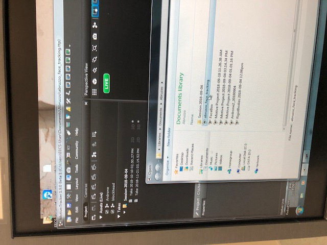
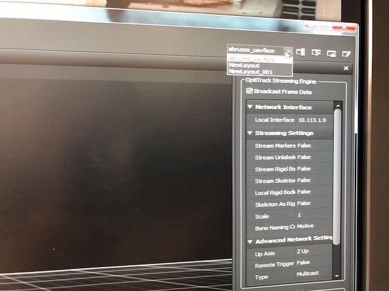

---
Set up the lab:
=======
The Ar.Drone is configured to connect to the Linksys e2500 router (bottom in this image) 

Make sure that the green ethernet cable is connected to the e2500 router, this connects the computer running Optitrack Motive to the netowkr that will be used for ROS and the AR.Drone.  This must happen before Optitrack Motive is launched in windows.  Open Motive Now.  

Open the project "abruzzo_face_tracking".  This should load in the opbjects "Ardrone" and "blockhead".

To configure the Motive workspace, from the drop down in the top right corner, choose "abruzzo_uavface"

Make sure Optitrack Tracker is publishing on the Linksys network.

---
Ar.Drone Face Tracking demo with optitrack feedback
=======

Set AR.Drone to connect to router, using a laptop or PC, connect to the ssid "ardrone2_<######>", in terminal type 

	roscd usma_ardrone && cd ../wpa_support 
	script/install_linksys
	script/connect_linksys

"install_linksys" needs only to be called once, but "connect_linksys" must be called each time the drone is powered down, such as when changing the battery. Now connect the laptop to the linksys router network ARDRONE250024ghz and test whether the ardrone is connected to the same network:

	ping 192.168.0.25

if the ping returns a response time, then the ardrone is connected to the same network on the correct ip address

---
If you plan on logging data, run :

	. ~/ros/src/usma_ardrone/scripts/makedirs.sh 20181121 1 5

	. ~/ros/src/usma_ardrone/scripts/makedirs.sh <yyyymmdd> <run first index> <run last index>

---

Assuming the optitrack software and cameras are booted and running, to launch the demo, first launch the vrpn service. This will stream the optitrack pose data as a ros message. (note this assumes the Ethernet cable for the optitrack pc has been switched from EECSDS3 to the linksys router, it has not been tested on EECSDS3)

	<!-- roslaunch optitrack_controller vrpn.launch -->

To run the face tracking demo, the following command file will launch the control and tracking nodes for the ardrone

	roslaunch optitrack_controller track_face.launch network:=linksys

	roslaunch optitrack_controller track_face.launch network:=linksys logging:=true date:=20181121 run:=001

Finally to have the drone takeoff :

	rostopic pub -1 /ardrone/takeoff std_msgs/Empty

-or-   

	roslaunch optitrack_controller liftoff.launch

To give the uav permission to track faces: 

	rostopic pub -1 /ardrone/face/face_permission_topic std_msgs/Empty

To land;

	rostopic pub -1 /ardrone/land std_msgs/Empty

If there is an issue during takeoff, or if you need to do a hard abort for some reason, you may need to reset the drone before taking off a second time:
	
	rostopic pub -1 /ardrone/reset std_msgs/Empty

---
Connect to the AR.Drone directly
=======
If you are directly connected to the ardrone network, the following launch file will launch the ardrone controller
	roslaunch optitrack_controller ardrone_direct.launch

---
Launch the face_tracker when directly connected to the ardrone
=======
roslaunch optitrack_controller ardrone_direct.launch  
roslaunch optitrack_controller track_face.launch  

---
Connect to ARDrone using linksys router and running the whole face tracking pipeline
=======
roslaunch optitrack_controller track_face.launch network:=ardrone #(directly connect to uav network)  
roslaunch optitrack_controller track_face.launch network:=linksys  
roslaunch optitrack_controller track_face.launch network:=EECSDS3  

roslaunch optitrack_controller track_face.launch network:=linksys logging:=true run:=004 

rostopic pub -1 /ardrone/face/face_permission_topic std_msgs/Empty

---
Finding a MAC address
=======
	>> telnet 192.168.1.1
	>> ifconfig

ardrone2_234879  ::  90:03:B7:38:0D:72  
ardrone2_065412  ::  90:03:B7:31:18:D5  
ardrone2_049677  ::  90:03:B7:E8:3C:D8  
